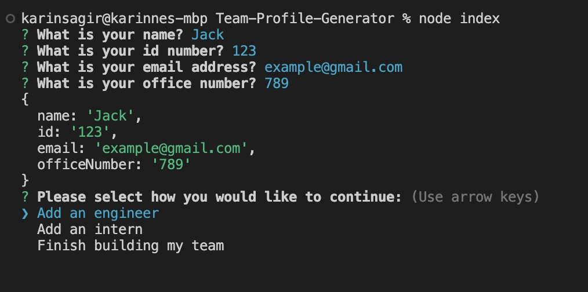
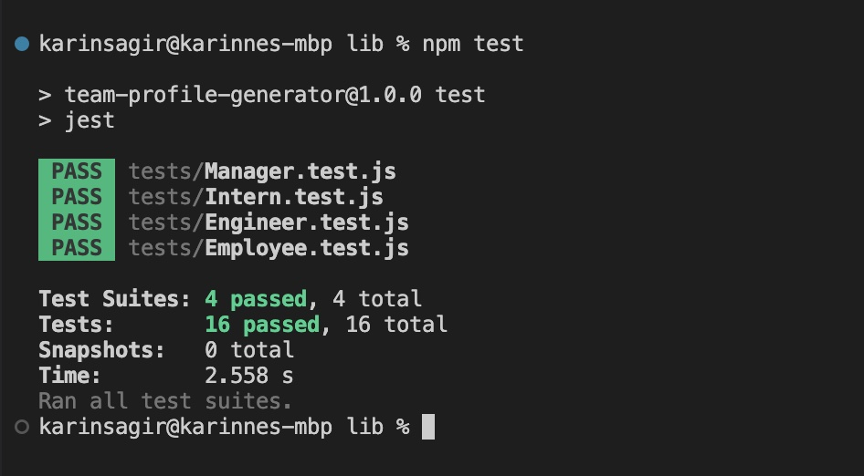

# Team-Profile-Generator
Object-Oriented Programming Challenge: Team Profile Generator

## Description

This Node.js command-line application takes in information about employees on a software engineering team and generates an HTML webpage that displays summaries for each person.

Here is a [Link](https://drive.google.com/file/d/1nZTGkR06_RMv5J2nhtRhYon9KpwqEFMJ/view) to a walkthrough video that demonstrates the functionality of the application.

### User Story

```
AS A manager
I WANT to generate a webpage that displays my team's basic info
SO THAT I have quick access to their emails and GitHub profiles
```

### Acceptance Criteria

```
GIVEN a command-line application that accepts user input
WHEN I am prompted for my team members and their information
THEN an HTML file is generated that displays a nicely formatted team roster based on user input
WHEN I click on an email address in the HTML
THEN my default email program opens and populates the TO field of the email with the address
WHEN I click on the GitHub username
THEN that GitHub profile opens in a new tab
WHEN I start the application
THEN I am prompted to enter the team manager’s name, employee ID, email address, and office number
WHEN I enter the team manager’s name, employee ID, email address, and office number
THEN I am presented with a menu with the option to add an engineer or an intern or to finish building my team
WHEN I select the engineer option
THEN I am prompted to enter the engineer’s name, ID, email, and GitHub username, and I am taken back to the menu
WHEN I select the intern option
THEN I am prompted to enter the intern’s name, ID, email, and school, and I am taken back to the menu
WHEN I decide to finish building my team
THEN I exit the application, and the HTML is generated
```

## Table of Contents

If your README is long, add a table of contents to make it easy for users to find what they need.

- [Installation](#installation)
- [Usage](#usage)
- [License](#license)
- [Features](#Features)
- [Tests](#Tests)

## Installation

The application can be invoked through the command line using the following command:

```
node index.js
```

## Usage

Use the intergrated terminal to build a team and add as many members as needed.

Example of prompt:



## License

This project is licensed under the MIT license. For more information on the MIT license, please use the following link: https://opensource.org/licenses/MIT.

## Features

1. JavaScript
2. Node.js
3. Bootstrap
4. Inquirer
5. Jest
6. Object-Oriented Programming

## Tests

Jest testing:

